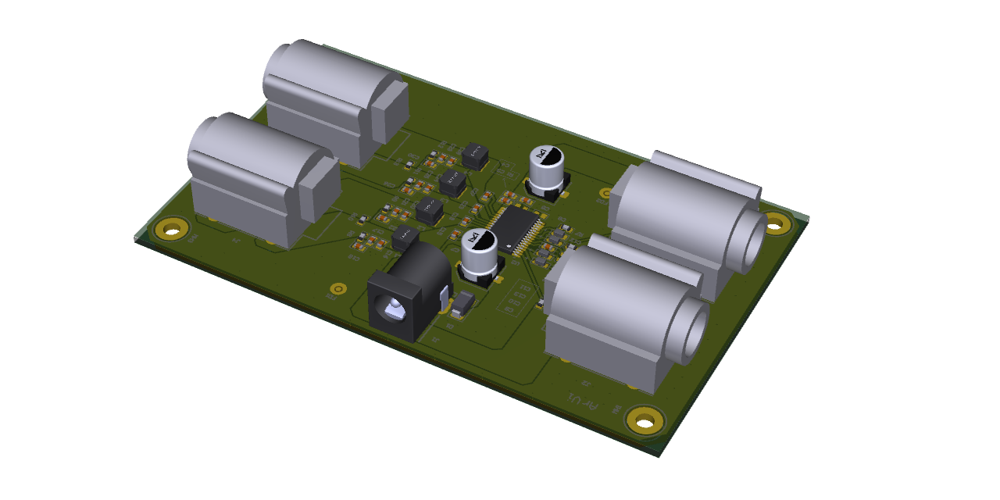

# Class-D Amplifier Board PCB Design

## Overview

This project involves the design of a Class-D amplifier PCB utilizing Texas Instruments' TPA3130D2DAPR 2x15W Class-D amplifier IC. The PCB was designed using Altium Designer 23, based on the schematic provided in Phil's Lab tutorial ([youtube.com](https://www.youtube.com/watch?v=wCYNTt5krDM&ab_channel=Phil%E2%80%99sLab)).

## Project Highlights

- **2-Layer PCB Design**: Designed a 2-layer board with a dedicated ground reference plane for improved signal integrity and noise reduction.
- **Material Specifications**: Utilized FR4 material with a thickness of 1.6mm.
- **Library Management**: Extracted and refined all component libraries in accordance with datasheet specifications and IPC standards.
- **Design Rule Compliance**: Ensured all design rules were meticulously followed as per IPC guidelines.
- **Manufacturing Outputs**: Generated comprehensive Gerber files and automated assembly files to facilitate seamless manufacturing and assembly processes.

## Repository Folder Contents

- `Assembly/`: Pick and Place information for SMT machine process.
- `BOM/`: Bill of materials listing all components used in the design.
- `Gerber/`: Manufacturing Files, PCB stack-up and layer information.
- `Images/`: Board Images 2D and 3D.
- `Mechanical/`: Contains files for mechanical design such as 3D STEP and DWG of Board.
- `Reports/`: Contains DRC and ERC status.
- `Schematic/`: Detailed schematic of the Class-D amplifier circuit.
- `Source Files/`: Directory containing Altium Designer project files.
- `CHANGELOG.md`: Documentation of changes and updates made throughout the project.
- `LICENSE`: License information for the project.

## Tools Used

- **PCB Design Software**: Altium Designer 22 and Viewmate (for gerber verification)

## Acknowledgments

The schematic design for this project was adapted from Phil's Lab tutorial on Class-D audio amplifier hardware design.
## About Me

I am a PCB design engineer with a focus on creating efficient and reliable layout designs. For more about my professional background, please visit my LinkedIn profile: [Vijayalakshmi M](https://www.linkedin.com/in/vijayalakshmi-m-542050314).

## License

This project is licensed under the [MIT License](LICENSE).

---

*Note: This project is intended for educational and demonstration purposes. The schematic design credits go to Phil's Lab.*
